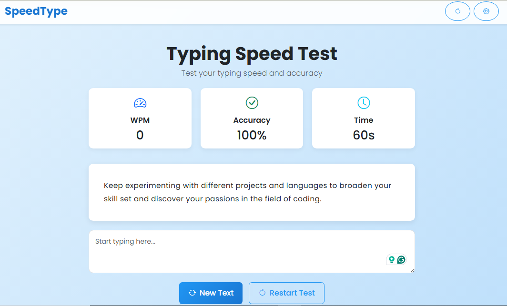

## 📜 MIT License
---




## 🌐 Live Demo

https://flask-wpm-typing-program.vercel.app/
OR
https://flask-wpm-typing-program.onrender.com/


# ⌨️ WPM Typing Test (FastAPI + JavaScript)

A full-stack typing speed test application built using **Python FastAPI** for the backend and **Vanilla JavaScript** for the frontend.

The app measures:

- Words Per Minute (WPM)
- Typing Accuracy
- Live typing feedback
- 60 second countdown timer

Random text is fetched dynamically from the backend API.

---

## 🚀 Features

- Real-time typing feedback (correct/incorrect highlighting)
- WPM calculation
- Accuracy tracking
- 60-second typing timer
- Random text generation from backend
- Fully interactive UI
- Restart / new text buttons

---

## 🧠 Tech Stack

**Backend**
- Python
- FastAPI
- Uvicorn
- Jinja2

**Frontend**
- HTML
- CSS
- JavaScript (Vanilla JS)

---

## 📂 Project Structure

````markdown
```bash
wpm-typing-test/
│
├── tutorial.py
├── text.txt
├── requirements.txt
│
├── static/
│   ├── style.css
│   └── script.js
│
└── templates/
    └── index.html
```

## ⚙️ Installation (Run Locally)

**Clone the repository:**

```bash
git clone https://github.com/yourusername/wpm-typing-test.git
cd wpm-typing-test


- Install dependencies:
pip install -r requirements.txt


- Run the server:
uvicorn tutorial:app --reload


- Open in browser:
http://127.0.0.1:8000


- Example API Endpoint
GET /get-text
```

## 5. Format API response properly
**Response:**

````markdown
```json
{
  "text": "Practice makes progress."
}


